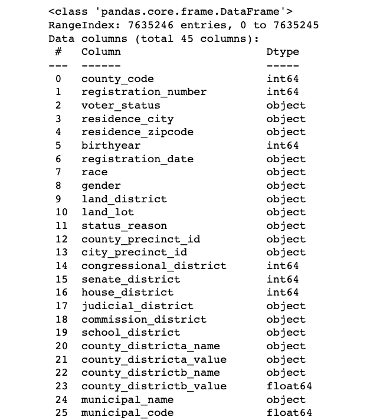
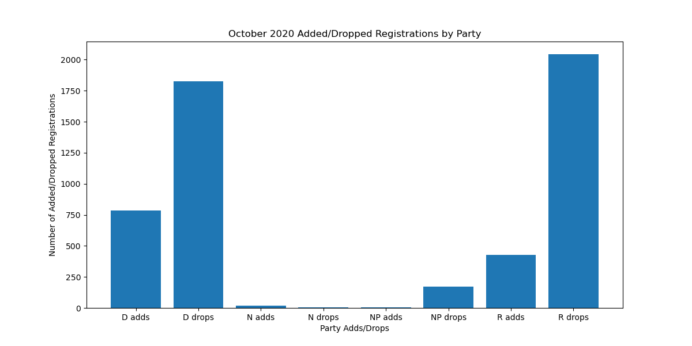
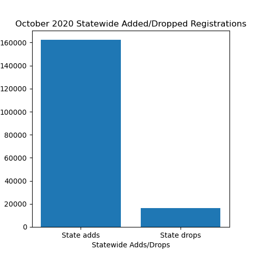
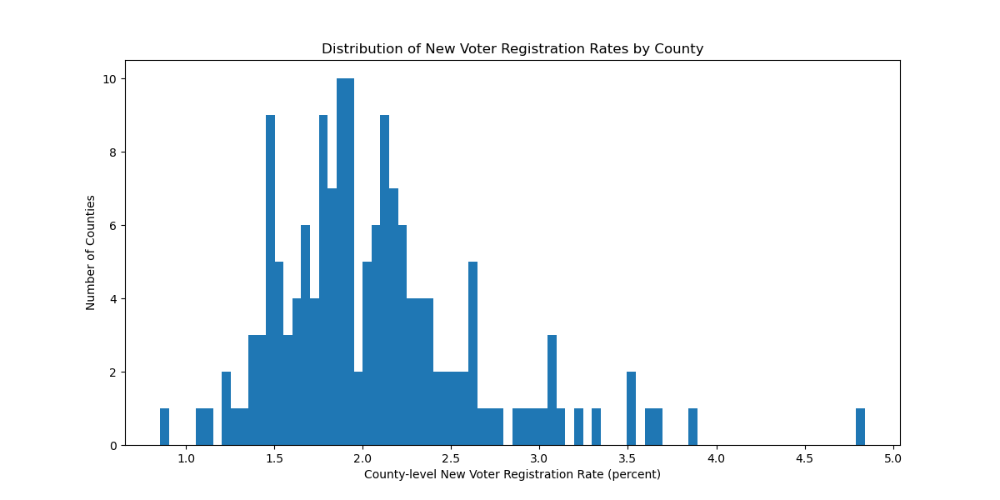
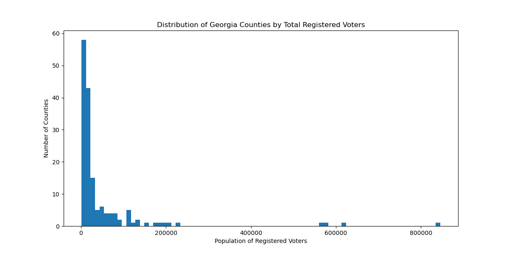
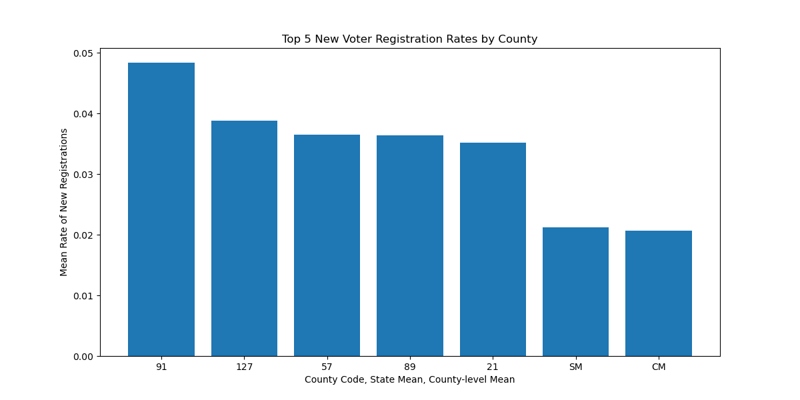
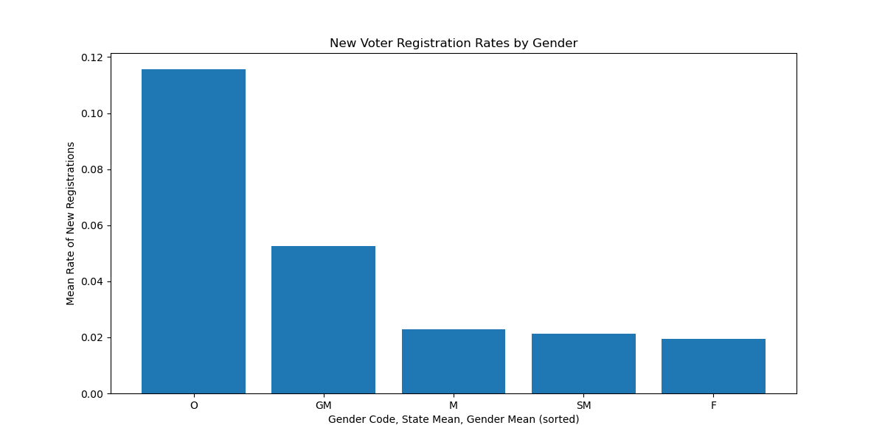

# **Detecting Irregularities in Voter Registration Records**

## **Project Question**

> **Can irregularities in voter registration records be detected by comparing mean values for new voter registrations among population subsets to mean values for new registrations for the population as a whole?**

Given accusations of voter fraud and voting irregularities circulated in the aftermath of the 2020 General Election, an aspiring data scientist may wish to subject these claims to the scrutiny of statistical analysis. To that end, I am investigating Georgia voter registration records for evidence of irregularity. Since the public records contain no personally identifying information, irregularity would have to involve adding or removing voter registrations improperly as indicated by excessive rates of new voter registration among constituencies that historically tend to favor one party over another. Accordingly, this project subdivides the Georgia electorate geographically (by county), demographically (by gender) and on the basis of party affiliation. My assumption is that voter fraud would be indicated by statistically significant differences in voter registration rates among these groups when compared to statewide registration rates.

## **Raw Data Description and Source**
The data for the project was compiled by the American Voter Project and posted on [Kaggle](https://www.kaggle.com/gabrielaltay/georgia-voter-list-202011). Due to the size of the dataset, users of this repository will need to download the data from Kaggle. The dataset consists of 31 tables of varying formats (1 .json, 9 .geojson and 21 .csv files). My analysis relies exclusively on the October 2020 tables for total voter registrations and and new voter registrations consisting of 7,635,245 and 162,242 records, respectively, and 45 columns each.

> **That's a lot of records!**

Geographic data includes information such as zip code of residence, municipality, county and governmental entities such as school district, municipal district and congressional district. For the sake of simplicity and in order to utilize relatively consistent data, my analysis focuses on county and state level geographical records.

Demographic data subdivides the electorate by age, gender, race and racial description. The age, gender and race categories are consistent and complete. I chose gender categorization as an entry point to demographic subsets of the population with the understanding that a more robust code base could analyze not only racial categorization, but gender subsets also subdivided by race in order to achieve a far more granular level of insight.

Finally, partisan data is relatively sparse for new registrations. The dataset captures the last party a voter affiliated with in an election that the voter participated in. That means the voter had to have a declared party affiliation when they last voted. Predictably, in the case of new voter registrations, this would seem to be an unlikely set of circumstances. Paradoxically, a few new voter registrations have party affiliations.

> **Notice that there are more drops than adds?**

As a result, dropped registrations offer a slightly better insight into voter registration irregularities along partisan lines. The improvement is only slight because, in general, there are usually far fewer registrations dropped than added as registration records are updated. In all likelihood, this results from the fact that new registrations are actively requested by individuals interested in voting, while registrations only tend to be dropped through discovery by astute elections officials.

> **Normally, adds exceed drops significantly.**

## **Exploring and Analyzing the Data**
Analyzing the different subsets of data had more commonalities than differences. Since all questions of voter registration could be answered as a binary, i.e. yes, the registration is new (1) or no, the registration is not new (0), the geographic, demographic and partisan subsets examined all took on characteristics of a binomial distribution.

### Means to an End
Having selected the binomial distribution to model the observed data, the next question that arose was how to establish a mean value for the rate of added registrations for geographic and demographic subsets or the rate of dropped registrations for partisan subsets.
Since the geographic categorization by county offered a large number of subsets corresponding to Georgia’s 159 counties, choosing the mean raised some issues. The majority of counties coalesced around a rate just under two percent for added registrations, however a few outlier counties had values at more than twice this rate. 

> **Most counties cluster just below the mean.**

Also, while most counties had fewer than 50,000 registered voters, a few large counties exceeded 200,000. Using the state mean could favor the mean set by these large counties, whereas taking the mean of the rates observed in each individual county would effectively compare apples to apples (county to county) irrespective of population.

> **Similarly, most counties are relatively small.**

Luckily, the state-level mean of registrations and the county-level mean were fairly close together making the choice to select the more conservative county-level mean not only warranted, but easy.

> **Top outliers nearly doubled state and county level means, which only differed slightly.**

With respect to demographic and partisan divisions, the choice of mean became much easier because the paucity of categories allowed for the choice of no decision at all. With only three categories for gender and four for party, the average mean varied to a greater degree due to small subgroups with much higher rates skewing the categorical average on the whole.

> **The smallest group has the highest mean, skewing the normalized average.**

Because there were so few categories to analyze, it remained practical to compare distributions using both means. In the event that either mean turned up a statistically significant result, the choice of mean could bear greater scrutiny at that time.

### The Secret is There ain’t no Secret
The prevailing null hypothesis guiding all of the experiments in this project holds that the means observed when subdividing the population will fall within the expected confidence interval established by the mean rate of voter registrations for the state as a whole. In each experiment I normalized the state mean with respect to the category under investigation and either substituted that normalized mean for the state mean, as in the case of the geographic subsets categorized by county, or compared the categorically normalized mean to the simple state mean in order to determine what if any differences might arise by preferring one value to another.

Using a standard rejection threshold of five percent, I applied single-tailed tests on the assumption that the observed outliers, being greater than the normalized or simple means, would constitute irregularities because they exceeded the range of mean values predicted by the means for the general population. This would also have the effect of lowering the threshold for constituting an irregularity (falsely rejecting the null hypothesis), so a correction, such as Bonferroni, could be applied to recalculate the rejection threshold on an ad hoc basis in the event that a potential irregularity were detected.

Ultimately, the null hypothesis won out uniformly in all contests. More accurately, none of the experiments, which involved subtracting from one the CDF of the value of added or dropped registrations for the category based on the binomial distribution constructed from the chosen mean, yielded anything approaching a significant result.

>>>>>>**Code Example:**
>
>``binomial = stats.binom(n=sample_population, p=chosen_mean)``
>
>``p-value = 1 - binomial.cdf(number_of_adds/drops_for_category)``

## **Conclusions and Directions for Future Research**
While one could conclude that the project’s failure to reject the null hypothesis underlines the validity of Georgia voter registration records, I remain skeptical that either the statistical approach or the sophistication of the code base are sufficient to warrant such a conclusion. To be clear, I am not alleging that there were likely irregularities where none were observed, but rather suggesting that the statistical approach and the coding technology employed limited the project to low level detail where irregularities would be sure to attract scrutiny from outside the discipline of data science. Accordingly, a more granular approach that combines various geographic and demographic categories, such as the potential for differences not only among individual counties, but collections of counties, such as urban versus rural counties, highly segregated versus integrated counties, could identify or fail to identify irregularities found outside the limited scopes of residency, gender and party affiliation. These more granular approaches would require not only more sophisticated statistical analyses, but also a more robust code base capable of isolating and feeding data into those increasingly sophisticated statistical models.